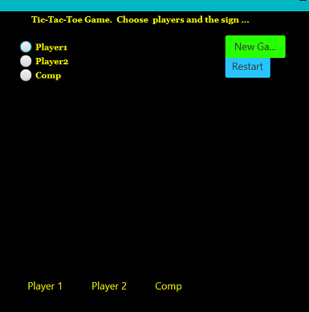
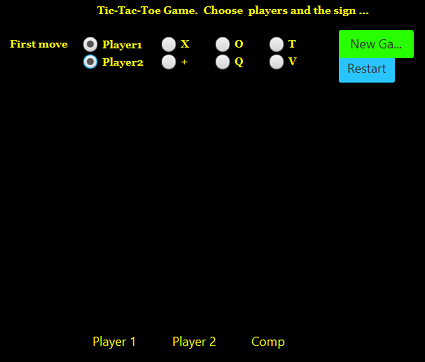
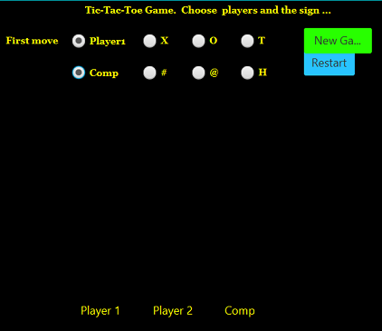
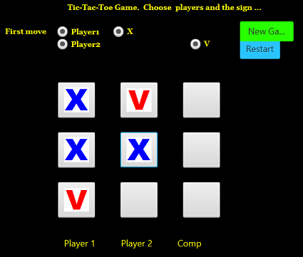
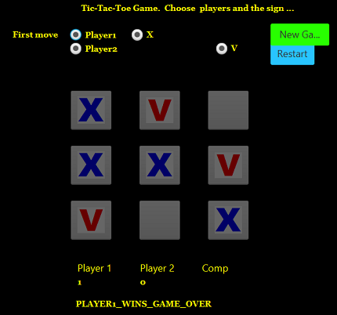
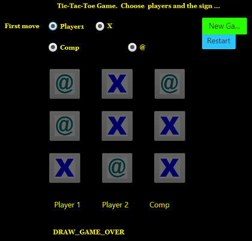

# TicTactToeJB  

## Tic Tac Toe (noughts and crosses) game build in Java, author: Jacek Byzdra  

## Description  
- The project presents Tic Tac Toe game for two players, who take turns marking the spaces in a 3×3 grid.  
- The player who succeeds in placing three of their marks in a horizontal, vertical, or diagonal row is the winner.  

##Game phase 1  
- When the game is started there is option to choose two players from: Player1, Player2, Comp.  
- When Player1 and Player2 are marked, the game is played between two human persons , step by step.  
- When Player1 and Comp is marked, or Player2 and Comp is marked,  the game is played with the computer and one human.  
- Every time first is marked Player1, or Player2, or Comp he start first move in the game.  

##Game phase 2  
- When the players are chosen, there is option to mark one symbol each player will use in the game.  
- Symbols available for Player1: X , O , T  
- Symbols available for Player2: + , Q , V  
- Symbols available for Comp:  # , @ , H

##Game phase 3
- The players take turns one by one marking the symbols in a 3×3 grid  
- The player who succeeds in placing three of their marks in a horizontal, vertical, or diagonal row is the winner.   
- The scores of the game is counted and displayed in the bottom board  
- The button New Game invokes new game between the same players , and old scores are kept in the bottom board.  
- The button Restart when pressed invokes restart of the game to phase 1  
  

## Technologies Used  
- Java 
- JavaFX  
- CSS  

## Code Explaination
The code is split in several modules which plays different role in the game . The OOP  is used.
- Cell.java: keeps data of Board's cells state, movement of players, and priorities weights for computer  move when Comp player  is in the game  
- Model.java:  keep methods , functions for players  
- Player.java: keeps the player's state, choosed players in the game, statistics who wins  
- FXML1.fxml with FXML1Controller.java  handle graphic user interface displaying board of the game, 3x3 grid board, symbols used, stats, restart and new game buttons  

## How to run 
**Compiling with IDE**   

- Clone the repository  
- Open the folder on IDE  
- Compile project  
- Execute on IDE   

**Running with self executing jar**  
- Run the TicTacToeJB.jar file  

### Author

**Jacek Byzdra**  
*Software Developer  
jacek.jaroslaw.byzdra@gmail.com  
[Linkedin](https://www.linkedin.com/in/jacek-byzdra/) - [GitHub](https://github.com/jacekbwwa)*

### License
This work is available under a Creative Commons License Attribution - Non-Commercial Use - No Derivative Works 4.0 International

